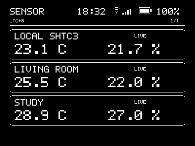
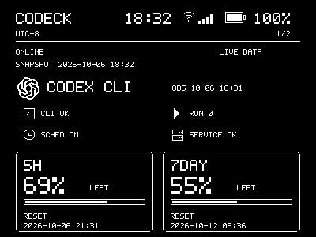
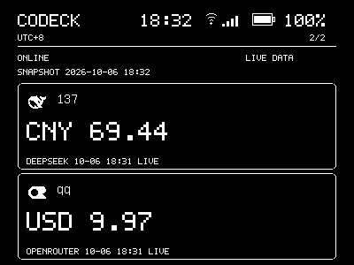
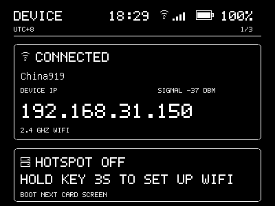
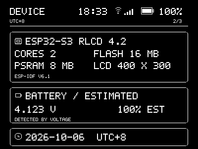
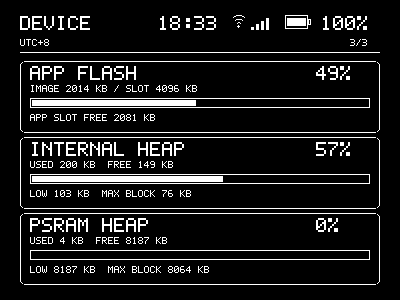

# ESP32-S3-RLCD-4.2

基于 Waveshare ESP32-S3-RLCD-4.2 开发板的固件项目，将 4.2 英寸黑白 RLCD 用作家庭环境与设备状态面板。

## 项目介绍

设备读取板载 SHTC3 温湿度，以及 Home Assistant 中的房间温湿度和主机监控数据；也可查看 Codeck 的服务状态、使用额度和账户余额。网络与系统页面展示 Wi-Fi 状态、设备信息和资源使用情况。未配网时，可通过设备热点完成 Wi-Fi 设置。

KEY 用于切换环境、Codeck 和设备页面，BOOT 用于浏览页面中的其他内容。屏幕为 400 × 300 横向单色显示。

## UI 预览

以下画面来自设备实际运行时的采集。更多状态和页面样例可查看[完整 UI 预览](docs/ui-preview/index.html)和 [Codeck 状态预览](docs/codeck-live-preview/index.html)；这些预览使用合成测试数据。

| 环境与温湿度 | Codeck 额度 |
| --- | --- |
|  |  |
| 本机及两个房间的温湿度。 | 服务状态、5 小时和 7 天额度及重置时间。 |

| Codeck 账户余额 | Wi-Fi 网络 |
| --- | --- |
|  |  |
| 展示账户余额和数据状态。 | 展示连接、信号、设备 IP 和热点状态。 |

| 设备信息 | 内存使用 |
| --- | --- |
|  |  |
| 展示芯片、屏幕、电池和日期信息。 | 展示固件、内部内存和 PSRAM 使用情况。 |

## 文档

- [项目说明与开发指南](docs/project-guide.md)：详细功能说明、硬件信息、配置、构建、烧录和验证记录。
- [统一 UI 与手动导航规格](docs/specs/unified-ui-and-manual-navigation.md)：界面行为和相关项目决策。
- [UI 预览工作流](docs/ui-preview-workflow.md)：主机端预览的生成方法及其验证范围。

## 上游资源

- [Waveshare 产品文档](https://docs.waveshare.net/ESP32-S3-RLCD-4.2/)
- [ESP-IDF 官方文档](https://docs.espressif.com/projects/esp-idf/)
